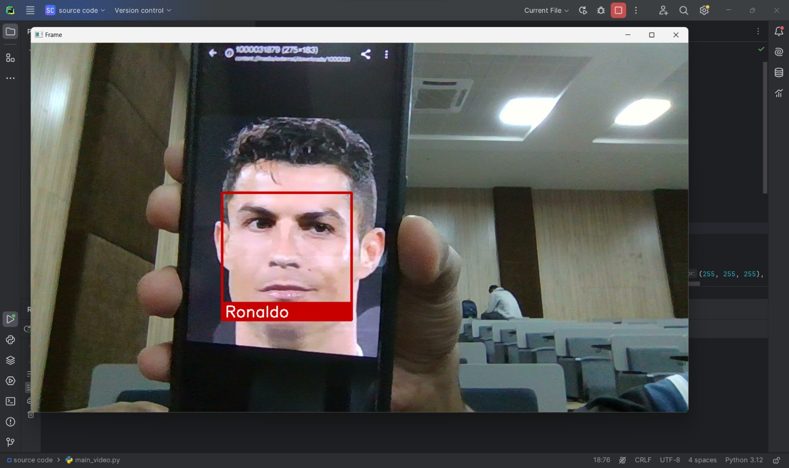

# Face Recognition with OpenCV and Face Recognition Library

This project demonstrates real-time face recognition using OpenCV and the `face_recognition` library. The system detects faces from a live camera feed and identifies them based on pre-encoded images.

## Features
- Detects faces from live video feed.
- Recognizes known faces based on pre-encoded images.
- Highlights identified faces with bounding boxes and names.

## Prerequisites

### Software Requirements
- Python 3.6 or higher  
- OpenCV  
- face_recognition library  
- NumPy  

### Hardware Requirements
- A working webcam for real-time face detection.

## Installation
1. Clone this repository:
   ```bash
   git clone https://github.com/mohammeduvez29/Facial-Recognition-Model.git
   cd Facial-Recognition-Model
   ```
2. Install required libraries:
   ```bash
   pip install opencv-python face_recognition numpy
   ```

3. Ensure you have a folder named `images/` in the root directory of the project. Add images of known faces to this folder. Name the images with the corresponding person's name (e.g., `john_doe.jpg`).

## Usage
1. Run the main script:
   ```bash
   python main_video.py
   ```
2. The system will access your webcam, detect faces, and identify known ones.
3. Press `ESC` to exit the program.

## Project Structure
```
.
├── main_video.py           # Main script for real-time face recognition
├── simple_facerec.py       # Helper class for face encoding and recognition
├── images/                 # Folder containing known face images
└── README.md               # Project documentation
```

## Code Explanation

### main_video.py
This script:
- Initializes the webcam.
- Loads known face encodings using the `SimpleFacerec` class.
- Detects faces in real-time and highlights them with bounding boxes and labels.

### simple_facerec.py
This class provides methods to:
- Load and encode images from the `images/` directory.
- Detect and identify faces in each frame using the `face_recognition` library.

## Example Output
- Recognized faces will be highlighted with a rectangle and their name displayed below the rectangle.
- Unknown faces will be labeled as "Unknown".

### Output Image Example
Here is an example of the face recognition output:



## Dependencies
Install the following libraries:
```
opencv-python
face_recognition
numpy
```

## Troubleshooting
- **Error: ModuleNotFoundError: No module named 'face_recognition'**  
  Ensure you have installed the `face_recognition` library. On some systems, you may need to install `dlib` before installing `face_recognition`:
  ```bash
  pip install dlib
  pip install face_recognition
  ```
- **Error: Camera not working**  
  Check your webcam permissions or ensure it is properly connected.

## License
This project is open-source and available under the MIT License.

## Acknowledgments
- [OpenCV](https://opencv.org/) for real-time image processing.
- [face_recognition](https://github.com/ageitgey/face_recognition) library for face detection and recognition.

## Contribution
Feel free to fork this repository and submit pull requests to improve the functionality or fix bugs.
